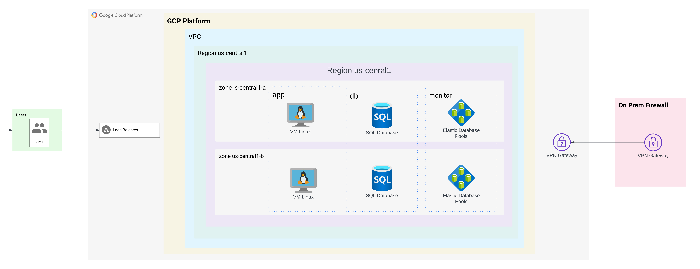

# PCI-DSS-IaC
## Terraform IaC
This document outlines the requirements and expectations for a project that adheres to PCI-DSS infrastructure as code using Terraform. The project's goal is to deploy VM instances, where one VM acts as a load balancer and two VMs function as application servers and 2 database servers that are in active replication in a private subnet that are not reacheable from the internet. The configuration ensures that the database is only accessible by the application servers and the infrastructure should meet the following criteria:

* **Infrastructure as Code**: The project must utilize Terraform to define and provision the required infrastructure resources on a cloud provider.
* **Virtual Machine Instances**: The project should create three VM instances: one acting as a load balancer and two serving as application servers.
* **Network Security**: The application servers and load balancer must not be directly reachable from the internet. Only specific ports necessary for communication should be accessible.
* **Database Connectivity**: The database should be able to communicate only with the two application servers, ensuring secure connectivity and preventing access from other sources.
* **Internet Access for Updates**: The VMs should have outbound internet access to download updates and packages required for system maintenance.
* **High Availability**: The application servers should be distributed across multiple availability zones or regions to ensure high availability and fault tolerance.

### Prerequisites

Before you begin, make sure you have the following:

* An active GCP account with appropriate permissions to create resources.
* Terraform installed on your local machine. You can download it from the official website: https://www.terraform.io/downloads.html
* Basic knowledge of Terraform and GCP.

### Project Structure
The project will be organized into the following modules:
* **network**: Creates the VPC network and subnetworks.
* **firewall**: Defines firewall rules to restrict access.
* **database**: Sets up the database instance.
* **load_balancer**: Configures the load balancer.
* **app_server**: Deploys the application servers.
* **vpn_server**: Deploy a VPN Server to allow management access.

### Requirements:
* **Network Segmentation**: Ensure proper network segmentation between the cardholder data environment (CDE) and other parts of your network. This can be achieved by creating separate subnets or networks for the CDE components.

* **Secure Network Configuration**: Configure security groups or firewall rules to restrict inbound and outbound traffic for each component. Allow inbound traffic only from the load balancer to the application servers and from the application servers to the database servers. Restrict all other inbound and outbound traffic to the necessary minimum.

* **Load Balancer Configuration**: Set up the load balancer to listen for incoming traffic on the appropriate ports (e.g., HTTPS). Configure the load balancer to forward traffic to the application servers only.

* **Application Server Configuration**: Ensure that the application servers only accept incoming traffic from the load balancer. Configure the necessary security groups or firewall rules to restrict access from any other source. Implement secure configurations for the application servers, including disabling unnecessary services and using secure communication protocols.

* **Database Server Configuration**: Place the database servers in a private subnet or network that is not directly accessible from the internet. Configure security groups or firewall rules to allow inbound traffic only from the application servers. Implement secure configurations for the database servers, including encryption of data at rest and in transit.

* **Encryption**: Enable SSL/TLS encryption for communication between the load balancer and the application servers. Configure the database servers to use encryption for data at rest.
 
* **Access Controls**: Implement strong authentication mechanisms for accessing the application servers and the database servers. Enforce the principle of least privilege by granting access only to necessary personnel. Utilize two-factor authentication (2FA) for administrative access to the infrastructure components.

* **Logging and Monitoring**: Configure logging for all infrastructure components, including the load balancer, application servers, and database servers. Implement log aggregation and monitoring solutions to detect and respond to security incidents.

* **Vulnerability Management**: Establish a process for regularly scanning the infrastructure for vulnerabilities. Implement a patch management system to keep all components up to date with the latest security patches.

* **Documentation and Policies**: Maintain documentation that outlines your security controls, procedures, and responsibilities. Develop and enforce security policies, incident response plans, and data retention policies.

### Expectations:
* **Modularity and Reusability**: The Terraform code should be modular, allowing for easy reuse and scalability. The code should use modules to define common resources, such as networking components, to promote maintainability and avoid duplication.
* **Documentation**: Clear and concise documentation should accompany the Terraform code, explaining its purpose, usage, and any required variables or configurations.
* **Version Control**: The project should use a version control system (e.g., Git) to manage and track changes to the Terraform codebase. The repository should have proper branching and commit practices.
* **Secret Management**: Sensitive information, such as credentials or access keys, should be stored securely, following best practices for secret management. Avoid hardcoding sensitive data within the Terraform code.
* **Monitoring and Logging**: Implement monitoring and logging solutions to capture relevant metrics, logs, and events related to the infrastructure and applications. This will assist in troubleshooting and performance analysis.
* **Testing and Validation**: Validate the infrastructure provisioning process by performing testing and validation of the deployed resources. Automated testing and integration with a continuous integration/continuous deployment (CI/CD) pipeline is recommended.
* **Security Best Practices**: Follow security best practices for the infrastructure and VM configurations. This includes employing secure network configurations, properly managing access controls, and applying regular security updates.
* **Scalability and Elasticity**: Design the infrastructure to be scalable and elastic, allowing for the addition or removal of application servers based on demand. Utilize autoscaling groups or similar mechanisms to handle traffic spikes efficiently.
